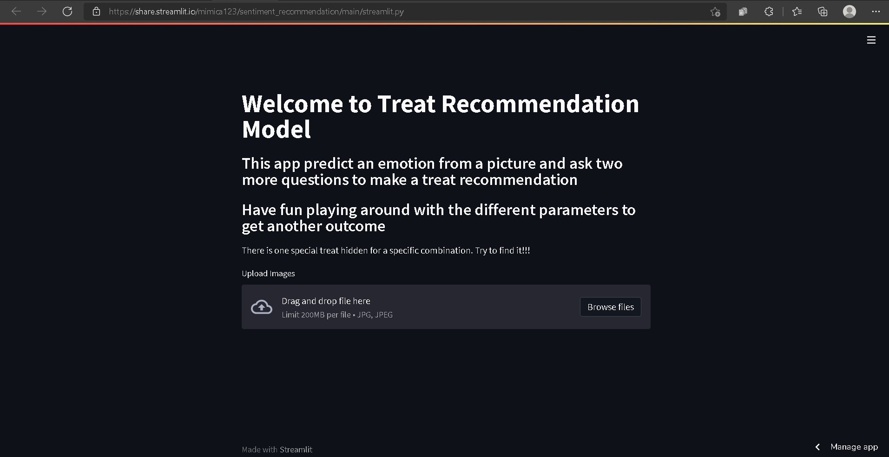

# Sentiment Analysis With Product Recomendation

Giants such as Amazon and Netflix took sentiment analysis to another level to attract more people based in users preferences and the reward of that effort has been generated billion of dollars. In social media the most common post is a picture which in the majority of cases represents users mood and emotions. This was the motivation to develop an application that can connects pictures linked to users emotions with a product recommendation as a strategy to attract customers and increase purchases.

